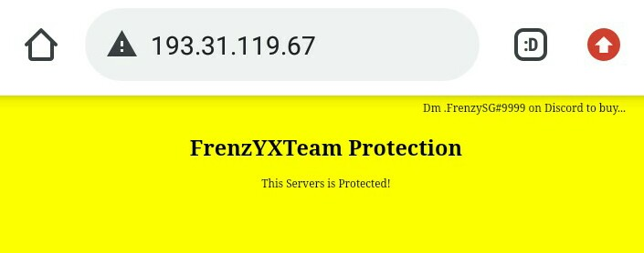

# GTPS-HTTP
- thanks for use this. if you want recode, republish please mention [FrenzySG/FrenzY8](https://github.com/FrenzY8) and read the License
<p align="center">

<div align="center">
  
# Preview 
<p align="center">

<div align="center">
  
<p align="center">

<a align="center">

# Run the Program
- ```node index.js```
- ```yarn build```
- ```yarn serve```

# Installation depencies
- ```npm install```
- ```npm i```
- ```yarn install```

# To be done List
- Nothing.

# Support me
- [Get me on Instagram](https://instagram.com/frenzy.666)
- [Donate me on saweria](https://saweria.co/frenzys6)
<p align="center">

<a align="center">

# License 
- License officially added via [Github](https://github.com) Features.
- all are entitled to use this program. and has been stamped by the [owner](https://github.com/FrenY8)
- This license lets others remix, tweak, and build upon your work even for commercial purposes, as long as they credit you and license their new creations under the identical terms. This license is often compared to “copyleft” free and open source software licenses. All new works based on yours will carry the same license, so any derivatives will also allow commercial use. This is the license used by Wikipedia, and is recommended for materials that would benefit from incorporating content from Wikipedia and similarly licensed projects

# Arigatou
<p align="center">

<a align="center">
